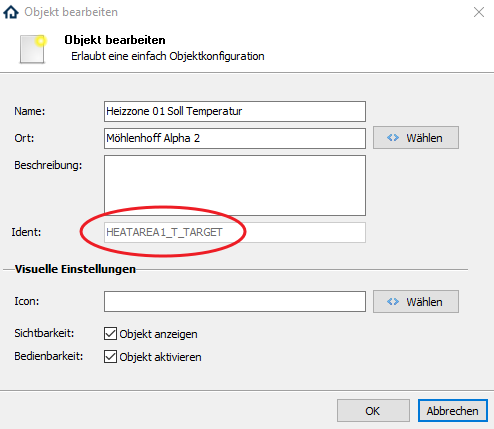

# Möhlenhoff Alpha 2
Das Modul dient zum Empfangen und Schalten von Möhlenhoff Alpha2 Daten.

### Inhaltverzeichnis

1. [Funktionsumfang](#1-funktionsumfang)
2. [Voraussetzungen](#2-voraussetzungen)
3. [Software-Installation](#3-software-installation)
4. [Einrichten der Instanzen in IP-Symcon](#4-einrichten-der-instanzen-in-ip-symcon)
5. [Statusvariablen und Profile](#5-statusvariablen-und-profile)
6. [WebFront](#6-webfront)
7. [PHP-Befehlsreferenz](#7-php-befehlsreferenz)
8. [Anhang](#8-anhang)

### 1. Funktionsumfang

* Setzen von Variablen via Skriptbefehl oder WebFront.
* Auslesen der Daten der Möhlenhoff Alpha 2

### 2. Voraussetzungen

- IP-Symcon ab Version 4.x

### 3. Software-Installation

* Über den Modul Store das Modul Möhlenhoff Alpha 2 installieren.
* Alternativ über das Modul Control folgende URL hinzufügen:
´https://github.com/symcon/MH`

### 4. Einrichten der Instanzen in IP-Symcon

- Unter "Instanz hinzufügen" ist das 'Möhlenhoff Alpha 2'-Modul unter dem Hersteller 'Möhlenhoff' aufgeführt.

__Konfigurationsseite__:

Name             | Beschreibung
---------------- | ---------------------------------
IP-Adresse       | IP-Adresse der Alpha 2
Intervall        | Einstellbares Intervall in Sekunden in denen die Daten der Alpha 2 abgefragt werden sollen. (Standard: 0)
Heizzone 1..12   | Aktiviert das Auslesen der jeweiligen Heizzone. (Die Heizkreise werden immer alle ausgelesen)
"Gerät auslesen" | Liest die Daten manuell aus. Muss auch einmalig zu Beginn gemacht werden.

### 5. Statusvariablen und Profile

Die Statusvariablen/Kategorien werden automatisch angelegt. Das Löschen einzelner kann zu Fehlfunktionen führen.

##### Statusvariablen
Die Variablen werden automatisch angelegt.

Name (Basis)                                 | Typ     | Beschreibung
-------------------------------------------- | ------- | ----------------
Basis Absenkdifferenztemperatur              | Float   | Dient als "Kategorie" in der sich alle überwachten Standorte, sowie der Zeitstempel und Längen-/Breitengrad befinden. Wird pro Gerät erstellt.
Basis Absenkeingang                          | Boolean | 
Basis Automatische Zeitumstellung            | Boolean | Ein/Aus der automatischen Zeitumstellung
Basis Betriebsart Heizen/Kühlen (CO-Eingang) | Boolean | Steuert die Betriebsart (Ein = Kühlen, Aus = Heizen)
Basis Frostschutz                            | Boolean | Ein/Aus des Frostschutzes
Basis Frostschutz Temperatur                 | Integer | Temperatur des Frostschutzes
Basis HW Version                             | String  | Hardware Version der Basis
Basis ID                                     | String  | ID der Basis
Basis Kühlen-Modus                           | Boolean | Ein/Aus des Kühlenmodus
Basis Rang im Systemverbund                  | Integer | Rand der Basis (0 = Standalone, 1 = Master, 2 = Slave)
Basis Smartstart ein/aus                     | Boolean | Ein/Aus des Smartstart
Basis SW ETH Version                         | String  | Software Version Ethernet
Basis SW STM Version                         | String  | Software Version STM
Basis Taupunktsensor                         | Boolean | Ein/Aus des Taupunktsensors
Basis Temperaturbegrenzer                    | Boolean | Ein/Aus des Temperaturbegrenzers
Basis Temperatureinheit                      | Integer | Einstellung ob Fahrenheit oder Celsius (0 = °C, 1 = °F)
Basis Urlaub Status                          | Integer | Urlaubstatus (0 = aus, 1 = geplant, 2 = aktiv)
Basis Urlaub Temperatur Heizen               | Float   | Temperatur während des Urlaubs

Name (Heizzone 1..12)                         | Typ     | Beschreibung
--------------------------------------------- | ------- | ----------------
Heizzone 01..12 Ist Temperatur                | Float   | Aktuelle Ist Temperatur
Heizzone 01..12 Soll Temperatur               | Float   | Soll Temperatur
Heizzone 01..12 Betriebsmodus                 | Integer | Betriebsmodus der Heizzone (0 = Auto, 1 = Tag, 2 = Nacht)
Heizzone 01..12 Ist Temperatur Ext. Sensor    | Float   | Aktuelle Ist Temperatur des externen Sensors
Heizzone 01..12 Anwesenheit                   | Boolean | Ein/Aus der Anwesenheit
Heizzone 01..12 Heizsystem                    | Integer | Das verwendete Heizsystem (0 = FBH-Standard, 1 = FHB-Niedrigenergie, 2 = Radiator, 3 = Konvektor passiv, 4 = Konvektor aktiv)
Heizzone 01..12 Korrektur Ist-Werterfassung   | Float   | Korrektur des Ist-Werts (-2.0 .. +2.0)
Heizzone 01..12 Name                          | String  | Name der Heizzone
Heizzone 01..12 Partyschaltung (Stunden)      | Integer | Wieviele Stunden die Partyschaltung laufen soll
Heizzone 01..12 Partyschaltung Restzeit (min) | Integer | Wielange die Partyschaltung noch aktiv ist
Heizzone 01..12 Programm Wochenende           | Integer | Welches Zeitprogramm am Wochenende aktiv ist
Heizzone 01..12 Programm wochentags           | Integer | Welches Zeitprogramm unter der Woche aktiv ist
Heizzone 01..12 Soll Temperatur Max           | Float   | Einstellbereich Soll-Temperatur (maximal)
Heizzone 01..12 Soll Temperatur Min           | Float   | Einstellbereich Soll-Temperatur (minimal)
Heizzone 01..12 Status                        | Boolean | Statusanzeige (0 = OK, 1 = Error)

Name (Heizkreis 1..12)               | Typ     | Beschreibung
------------------------------------ | ------- | ----------------
Heizkreis 1..12 Aktiv                | Boolean | Ob der Heizkreis aktiv ist (0 = Nein, 1 = Ja)
Heizkreis 1..12 Aktor                | Boolean | Ein/Aus des Stellantriebs
Heizkreis 1..12 Aktor Prozent        | Integer | Prozentuale Aktivität des Aktors (Nur bei SW STM Version 2.02 oder höher)
Heizkreis 1..12 Status               | Integer | Status (0 = Aus, 1 = An, 2 = Fehler)
Heizkreis 1..12 zugewiesene Heizzone | Integer | Welche Heizzone mit dem Heizkreis verbunden ist

##### Profile:

Name                          | Typ
----------------------------- | ------- 
MH.AntifreezeTemp             | Integer
MH.TemperatureUnit            | Integer
MH.SummerWinter               | Boolean
MH.ChangeOver                 | Boolean
MH.Mode                       | Integer
MH.EcoDiff                    | Float
MH.VacationState              | Integer
MH.PumpTime                   | Integer
MH.RelaisTime                 | Integer
MH.EmergencyTime              | Integer
MH.PWMCycle                   | Integer
MH.PWMPercent                 | Integer
MH.HeatAreaMode               | Integer
MH.HeatAreaProgram            | Integer
MH.HeatAreaParty              | Integer
MH.HeatAreaPartyRemainingTime | Integer
MH.HeatAreaState              | Boolean
MH.HeatAreaRPMMotor           | Integer
MH.HeatingSystem              | Integer
MH.HeatAreaTActualTemp        | Float
MH.HeatAreaTTarget            | Float
MH.HeatAreaTHeatCool          | Float
MH.HeatAreaOffset             | Float
MH.HeatAreaBlockHC            | Integer
MH.HeatAreaHeatCTRLState      | Integer
MH.HeatAreaNr                 | Integer
MH.HeatCtrlActorPercent       | Integer

### 6. WebFront

Über das WebFront oder in den mobilen Apps werden Werte angezeigt und können wenn möglich geändert werden.  
Wir empfehlen aufgrund der Menge der Variablen die Anzeige der gesamten Alpha 2 in der Verwaltungskonsole zu deaktivieren und alle gewünschten Variablen via Links in einer eigenen Kategorie anzeigen zu lassen.

### 7. PHP-Befehlsreferenz

`boolean MA2_RequestStatus(integer $InstanzID);`  
Ruft die in der Alpha2 mit der InstanzID "$InstanzID" gespeicherten Werte auf und setzt die dazugehörigen Variablen.
Die Funktion liefert keinerlei Rückgabewert.  
Beispiel:  
`MA2_RequestStatus(12345);`

`boolean MA2_WriteValue(integer $InstanzID, string $Ident, variant $Wert);`  
Schreibt den Wert "$Wert" in die Variable mit dem Ident "$Ident" in der Möhlenhoff Alpha 2 mit der InstanzID "$InstanzID".
Die Funktion liefert keinerlei Rückgabewert.  
Beispiel:  
`MA2_WriteValue(12345 , "HEATAREA1_T_TARGET", 23.3);`

Ident:  
Den Ident einer Variable kann man via "Rechtsklick->Objekt bearbeiten" herausfinden.
